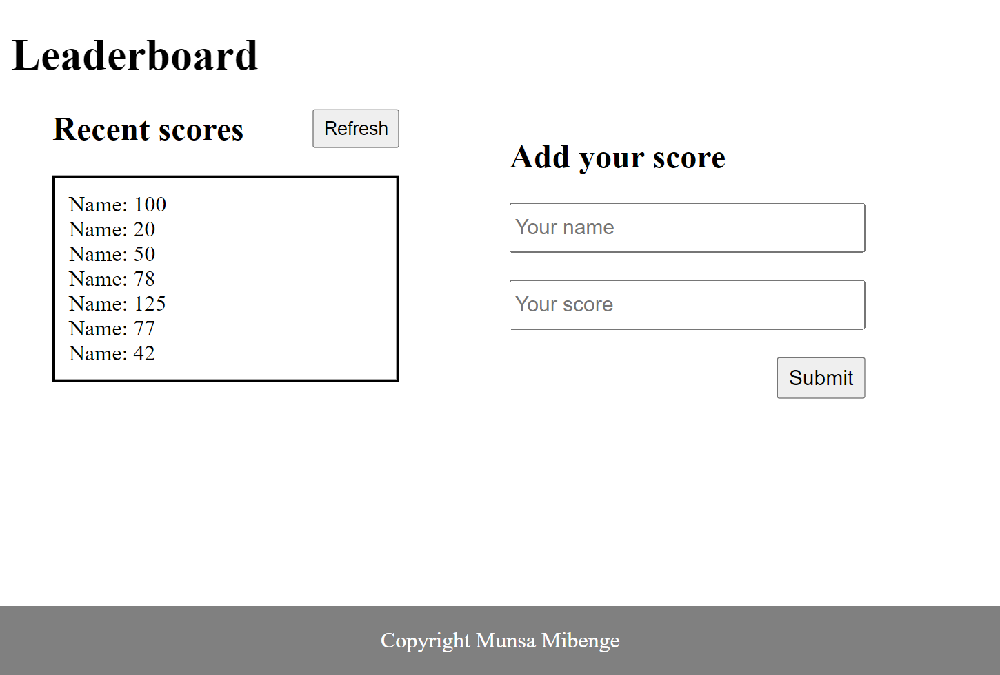

# Leaderboard

> Leaderboard repo 

## Built With

- HTML
- CSS
- JS

## Live Demo
[Live Demo](https://mmatongo.github.io/leaderboard/dist/)

## Getting Started

To get started locally follow these simple example steps.
- Fork and clone the repo to your computer using `git clone git@github.com:mmatongo/leaderboard.git` in the terminal or command prompt (this assumes that you have set up git to use your ssh key, if you haven't see [here](https://docs.github.com/en/github/authenticating-to-github/connecting-to-github-with-ssh)).
- Install [Node](https://nodejs.org/en/download/).
- Run the command `npm install` inside the repo in a terminal to install all the required dependancies.
- Create a new feature branch using `git checkout -b feature-name`.
- Run `npm start` to launch a live server and monitor changes as you code.
- Push the branch to github using `git push`
- Create a descriptive pull request detailing what your new feature is

## Authors

👤 **Daniel M. Matongo**

- GitHub: [Daniel M. Matongo](https://github.com/mmatongo)
- LinkedIn: [Daniel M. Matongo](https://linkedin.com/in/mmatongo)

## 🤝 Contributing

Contributions, issues, and feature requests are welcome!

Feel free to check the [issues page](../../issues/).

## Show your support

Give a ⭐️ if you like this project!

## 📝 License

This project is [MIT](./MIT.md) licensed.
